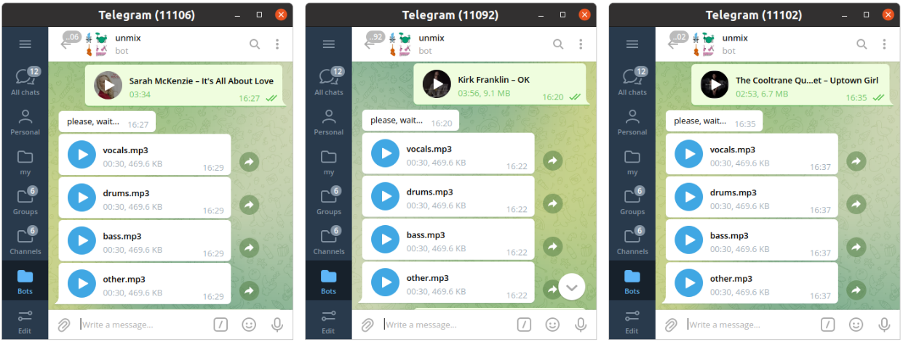

#### Music Source Separation

This tool allows you to extract the "sources" (bass, drums, vocals and other) from a given piece of music. The model is based on the [demucs](https://github.com/facebookresearch/demucs) architecture (mdx_extra_q pretrained on [musdb18](https://sigsep.github.io/datasets/musdb.html)). [[demo](https://t.me/vaaliferov_unmix_bot)]

